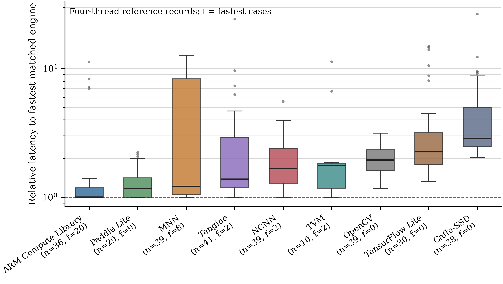

# Deployment-Stack Effects in ARM Edge Inference

This repository provides benchmark measurements, analysis scripts, and supplementary outputs for the manuscript:

**Deployment-Stack Effects in Multi-Engine Deep Neural Network Inference on ARM Edge Platforms**

The data support an empirical study of deployment-stack effects in deep neural network inference on ARM edge platforms. The analyzed stack dimensions include target board, operating-system configuration, inference engine, model or workload group, runtime configuration, latency, accuracy, and application-level memory measurements where available.

The repository is organized around analysis-ready CSV files, regenerated figures, and a compact reproduction script.

Repository URL: <https://github.com/ghimiredhikura/arm-edge-inference>

## Key Result

The main matched-comparison result shows that inference latency is strongly deployment-stack dependent. Each observation below compares engines under the same platform, operating-system configuration, model, and four-thread runtime setting; a value of 1 denotes the fastest engine for that matched condition.



## Deployment Stack

| Dimension | Item | Recorded OS configuration |
| --- | --- | --- |
| Platform/OS | [NVIDIA Jetson Nano](https://developer.nvidia.com/embedded/jetson-nano-developer-kit) | Ubuntu 18.04.4 LTS aarch64 |
| Platform/OS | [Raspberry Pi 3 Model B+](https://www.raspberrypi.com/products/raspberry-pi-3-model-b-plus/) | Debian GNU/Linux 10 aarch64; Raspbian GNU/Linux 9.6 armv7l |
| Platform/OS | [Raspberry Pi 4 Model B](https://www.raspberrypi.com/products/raspberry-pi-4-model-b/) | Debian GNU/Linux 10 aarch64; Raspbian GNU/Linux 10 armv7l; Ubuntu 20.04.1 LTS aarch64 |
| Engine | [ARM Compute Library](https://github.com/ARM-software/ComputeLibrary) | v19.11; v20.02.1; v20.08 |
| Engine | [Caffe-SSD](https://github.com/weiliu89/caffe/tree/ssd) | SSD branch |
| Engine | [MNN](https://github.com/alibaba/MNN) | 0.2.1.5; 1.0.0; 1.1.0 |
| Engine | [NCNN](https://github.com/Tencent/ncnn) | commits 9593783; 6f2ef19; b766c8c |
| Engine | [OpenCV](https://github.com/opencv/opencv) | 4.1.1; 4.2.0 |
| Engine | [Paddle Lite](https://github.com/PaddlePaddle/Paddle-Lite) | 2.1.0; 2.3.0 |
| Engine | [Tengine](https://github.com/OAID/Tengine) | v1.9.0; Tengine Lite v1.0 |
| Engine | [TensorFlow Lite](https://github.com/tensorflow/tensorflow) | 2.0.0; 2.1.0; 2.5.0 |
| Engine | [TVM](https://github.com/apache/tvm) | 0.7.0; 0.8.0 |

## Contents

- `data/`: CSV measurements and deployment-stack identifiers.
- `outputs/figures/`: figures regenerated from the CSV data.
- `scripts/reproduce_outputs.py`: regenerates supplementary check figures from the included CSV files.
- `requirements.txt`: Python dependencies.

## Reproduction

Install dependencies:

```bash
pip install -r requirements.txt
```

Regenerate supplementary outputs:

```bash
python scripts/reproduce_outputs.py
```

The script writes check figures under `outputs/figures/` and records the run summary in `outputs/reproduction_summary.json`.

## Measurement Scope

The measurements represent evaluated deployment stacks rather than universal rankings of inference engines. Comparisons in the manuscript are based on matched conditions whenever engines are compared directly. Low-level factors such as detailed thermal traces, external power measurement, board-to-board variation, and background scheduler state were outside the measurement scope, so absolute latency values should be transferred to other environments with care.

Caffe-SSD is included as a Caffe-based SSD deployment baseline. The embedded inference engine families represented in the data are ARM Compute Library, MNN, NCNN, OpenCV, Paddle Lite, Tengine, TensorFlow Lite, and TVM.
